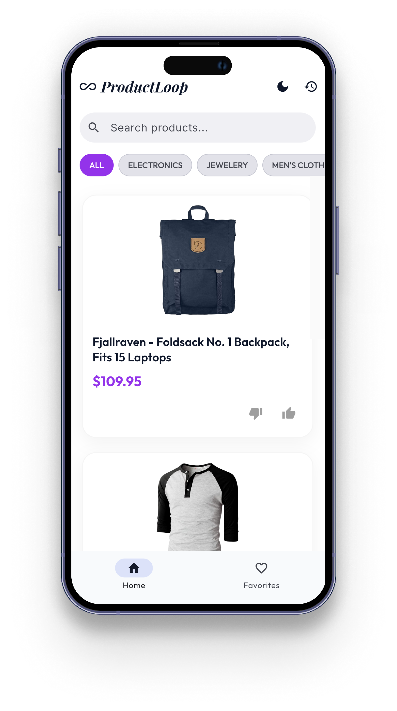
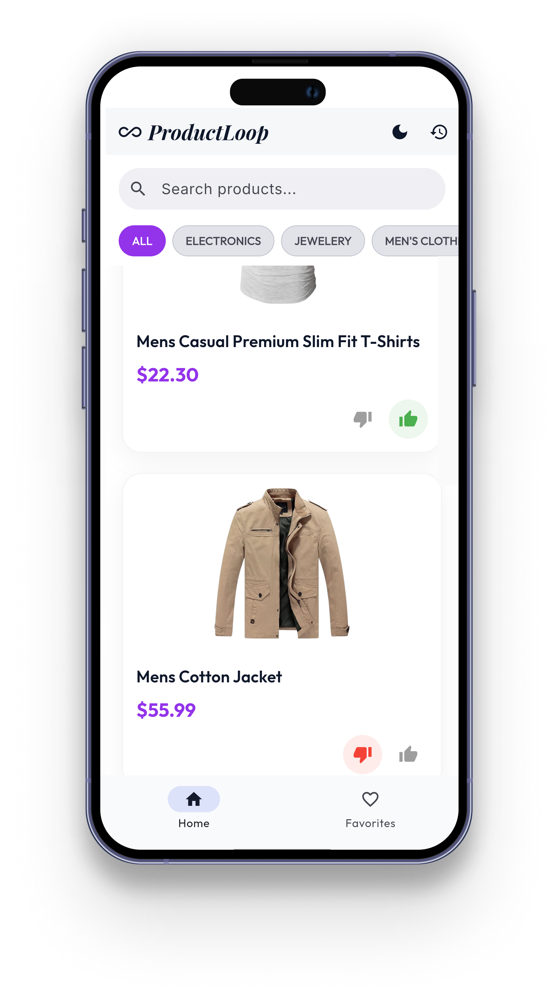
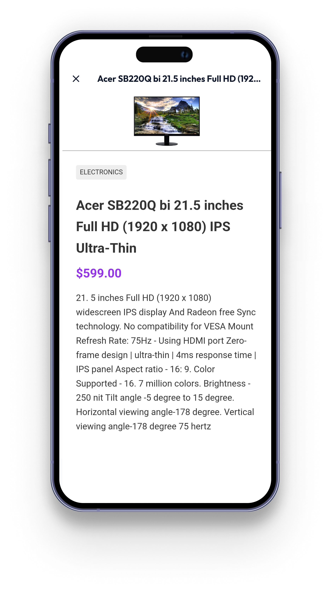

<h1 align="center"> ♾️ ProductLoop</h1>

  <em>Discover Smarter with Every Tap</em>

 A clean and structured Flutter application built as part of a technical evaluation challenge.  
ProductLoop demonstrates real-world mobile engineering concepts including API integration, structured state management, local persistence, and in-app browsing.

---

## 🧠 Overview

ProductLoop provides a streamlined product discovery experience. Users can browse products from a remote API, react to them (like/dislike), open product pages inside an internal WebView, and revisit previously viewed items via browsing history.

All user interactions persist locally, ensuring continuity even after app restarts.

This project was designed to demonstrate:

- Clean and maintainable architecture  
- Proper separation of concerns  
- Predictable asynchronous state handling  
- Local data persistence  
- Structured feature modularization  

---

## ✨ Features

- 🛍️ Dynamic product feed (FakeStoreAPI)  
- 👍 Like / 👎 Dislike interaction  
- 💾 Persistent preferences (Hive)  
- 🌐 Internal WebView product browsing  
- 🕘 Browsing history tracking  
- 🔄 Pull-to-refresh  
- ⚡ Optimistic UI updates  
- 📡 Loading & error handling with retry  
- 🧩 Modular feature-first architecture  

---

## 📸 Screenshots

  
  

  
  

  

---

## 🏗 Architecture & Approach

The app follows a feature-first modular architecture with strict separation of concerns.

### 🔁 Data Flow

API → Repository → Riverpod Provider → UI

- The UI does not directly call APIs  
- Repositories abstract network and storage logic  
- Providers manage state transitions  
- Widgets remain declarative and focused on presentation  

This ensures maintainability, predictable state updates, and scalability.

---

## ⚙️ State Management — Riverpod

Riverpod was chosen for:

- 🧼 Clean separation from UI  
- 🔄 Declarative async handling via `AsyncValue`  
- 📦 Centralized dependency management  
- 📈 Easy scalability  

All business logic resides outside widgets, keeping UI purely reactive.

---

## 💾 Data Persistence — Hive

Hive was used for lightweight local storage.

### Why Hive?

- 🚀 Fast key-value storage  
- 🧩 Minimal setup  
- 📱 Ideal for simple persistence needs  

Stored data includes:

- 👍 Liked / 👎 Disliked product IDs  
- 🕘 Browsing history URLs  

All preferences persist across app restarts.

---

## 🌐 WebView & History Tracking

When a product is tapped:

- Opens inside an internal WebView  
- URL is tracked automatically  
- History is stored locally  
- Users can revisit previously viewed products  

History is displayed in a dedicated screen with the option to clear it.

---

## 🛠 Handling Loading & Errors

To ensure reliability:

- `AsyncValue` manages loading/data/error states  
- Clear loading indicators are displayed  
- Retry option on failure  
- Defensive API handling with Dio  

Error states are surfaced to users with clear retry actions rather than silent failures.

---

## 📂 Folder Structure

Each feature is self-contained with its own models, providers, repository logic, and UI components.

---

## ⚖️ Trade-offs

Given the limited development time, the focus was placed on clean architecture and stable functionality rather than advanced UI animations or complex offline-first synchronization.

Some advanced optimizations such as paginated caching and deeper testing coverage were intentionally deferred.

---

## 🚀 What I Would Improve With More Time

- 🧪 Add unit and widget tests  
- 📄 Implement pagination support  
- 🔍 Improve search & filtering  
- 🎨 Enhance animations (Hero transitions)  
- 📶 Improve offline caching strategy  
- 🧱 Extract shared UI components  

---

## ⏱ Approximate Time Spent

**Total:** ~13 hours  

Breakdown:

- 🏗 Architecture & planning – 1.5h  
- 📡 API integration – 2h  
- 🔄 State management – 2h  
- 💾 Local persistence – 2h  
- 🌐 WebView & history – 2.5h  
- 🎨 UI polish & testing – 2h  

---

## 📦 Tech Stack

- 🐦 Flutter (latest stable)  
- 🌊 Riverpod  
- 🌐 Dio  
- 🗄 Hive  
- 🔎 WebView Flutter  

---

## 📌 Final Note

ProductLoop prioritizes engineering clarity over unnecessary complexity, delivering a stable and well-structured solution within a constrained development timeline.

---

## 👨‍💻 Author

Built with care by  
**Mohammed Sufiyan**

